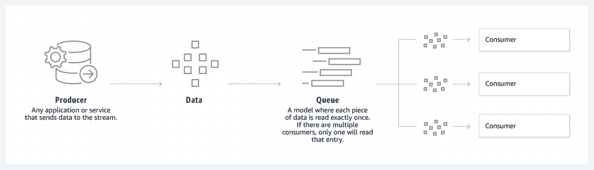
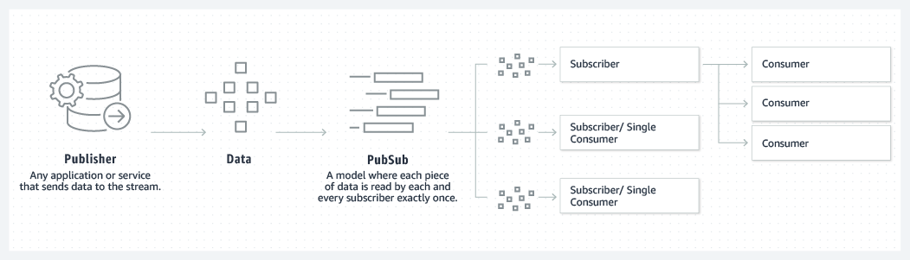

# Tecnología: Apache Kafka

## ¿Qué es Kafka? 

- Es un almacén de datos distribuidos optimizado para la ingesta y el procesamiento de datos en tiempo real. Los datos pueden ser generados de forma continua por miles de orígenes de datos que, por lo general, envían los registros de datos en simultáneo. Ofrece 3 funciones principales: 

    - Publica y se suscribe a flujos de registros.
    - Almacena de manera efectiva los flujos de registros en el orden en que se generaron los registros.
    - Procesa flujos de registros en tiempo real.

## ¿Como funciona Kafka?

- Kafka combina dos modelos de mensajería, el de cola y el de publicación-suscripción, para ofrecer a los consumidores las principales ventajas de cada uno de ellos. Kafka utiliza un modelo de registro particionado para unir estos dos modelos, de manera que, un registro es una secuencia ordenada de registros, y estos registros se dividen en segmentos o particiones que corresponden a diferentes suscriptores. Esto significa que puede haber varios suscriptores del mismo tema, y a cada uno se le asigna una partición para permitir una mayor escalabilidad.

### Creación de Colas



### Publicación-Subcripción



## Ventajas del Enfoque de Kafka

### Escalabilidad
- El modelo de registro particionado de Kafka permite que los datos se distribuyan en varios servidores, lo que los hace escalables más allá de lo que cabría en un solo servidor. 

### Rapidez
- Kafka desacopla las secuencias de datos para que haya una latencia muy baja, lo que lo hace extremadamente rápido. 

### Durabilidad
- Las particiones se distribuyen y replican en muchos servidores, y todos los datos se escriben en el disco. Esto ayuda a proteger contra las fallas del servidor, lo que hace que los datos sean muy tolerantes a los errores y duraderos.

## ¿Cómo Integra la Arquitectura de Kafka el Modelo de Creación de Colas con Publicación-Subcripción?

- Kafka corrige los dos modelos diferentes publicando registros sobre temas diferentes. Cada tema tiene un registro particionado, que es un registro de confirmaciones estructurado que realiza un seguimiento de todos los registros en orden y añade otros nuevos en tiempo real. Estas particiones se distribuyen y replican en varios servidores, lo que permite una alta escalabilidad, tolerancia a errores y paralelismo. A cada consumidor se le asigna una partición en el tema, lo que permite tener varios suscriptores y, al mismo tiempo, mantener el orden de los datos.

- Funciona con 4 API's:

    - API de productor: se utiliza para publicar un flujo de registros sobre un tema de Kafka.
    - API de consumidores: se utiliza para suscribirse a los temas y procesar sus flujos de registros.
    - API de transmisiones: permite que las aplicaciones se comporten como procesadores de transmisión, que toman un flujo de entrada de un tema y lo transforman en un flujo de salida que abarca diferentes temas de salida.
    - API de conexión: permite a los usuarios automatizar sin problemas la adición de otra aplicación o sistema de datos a sus temas actuales de Kafka.
 
Obtenido de: [Apache Kafka](https://aws.amazon.com/es/what-is/apache-kafka/)

# Implementación de Apache Kafca

- Para la implementación de Kafca se creó un servidor Kafka utilizando la herramienta de Docker llamada "Docker-Compose". Esta herramienta se utiliza para definir y gestionar servicios relacionados que necesitan interactuar entre sí, en este caso, se utiliza para definir y gestionar el servicio de Kafka y Zookeeper de la siguiente forma: [docker-compose.yml](docker-compose.yml).

Obtenido de: [Kafka con Docker](https://sacavix.com/2022/02/iniciando-kafka-con-docker/)

## Comandos Utilizados 

```bash
$ docker-compose up -d
```

- Se utiliza para crear e iniciar los servicios Zookeeper y Kafka definidos en el archivo ["docker-compose.yml"](docker-compose.yml) en segundo plano.

```bash
$ kafka-topics --create --topic <topic_name> --bootstrap-server <bootstrap_server> --replication-factor <replications_number> --partitions <partitions_number>
```

- Se utiliza para crear un tema en el servidor Kafka, el cuál permite al productor enviar datos hacia un tema en específico y que hayan varios consumidores (suscriptores) consumiendo y procesando dichos datos. 

    - `bootstrap_server` especifica la lista de servidores que se utilizan para conectarse al clúster de Kafka. Para efectos de esta aplicación: localhost:29092.

    - `replication_number` indica cuántas copias del tema se mantendrán en el clúster de Kafka para tolerancia a fallos. Para efectos de esta aplicación: 1.

    - `partitions_number` especifica el número de particiones del tema. Es la forma en que Kafka distribuye los datos dentro del tema para permitir el procesamiento paralelo. Para efectos de esta aplicación: 3.

        - El número depende de la cantidad de suscriptores que existan (consumidores). En caso de ser necesario, se puede utilizar el siguiente comando para escalar verticalmente (hacia arriba o hacia abajo) el número de particiones:

```bash
$ kafka-topics --bootstrap-server <bootstrap_server> --alter --topic <topic_name> --partitions <new_partitions_number>
```
